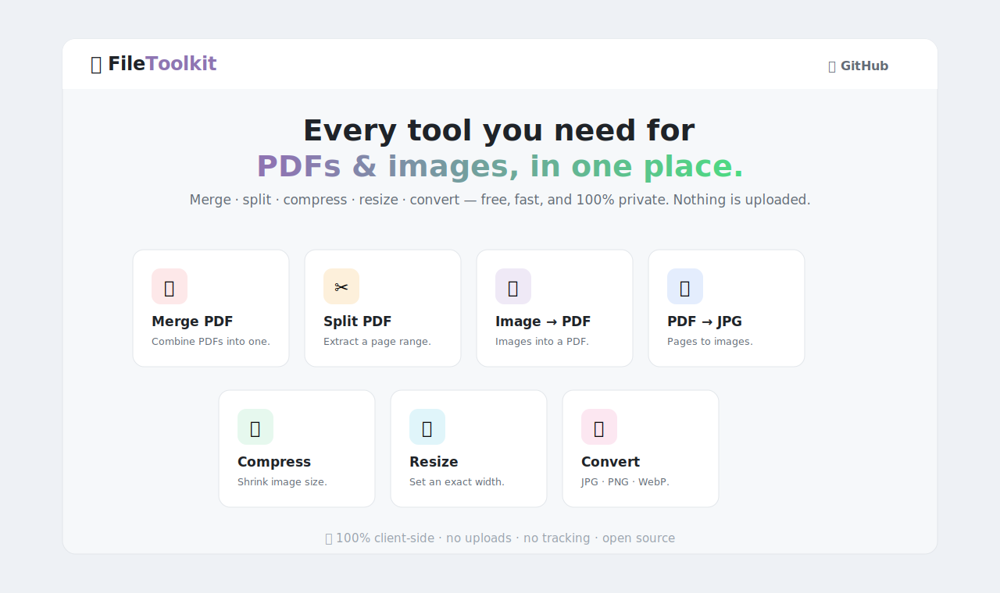

<div align="center">

# 🧩 Pglu

### Free PDF &amp; image tools — merge, split, compress, resize &amp; convert. 100% in your browser.


**An open-source, iLovePDF-style toolkit that runs entirely on your device — your files are never uploaded.**



🔗 **[Live Demo](https://aashishbharti04.github.io/file-toolkit/)** · ⭐ **Star it if it's useful!**

</div>

---

## ❓ Why Pglu?
Most online PDF/image tools make you **upload your private files to their servers**. Pglu does everything **locally in your browser** using the Canvas, File, and PDF APIs — so it's **private, instant, and works offline** (after first load).

## 🧰 Tools included
### 📄 PDF
| Tool | What it does |
|---|---|
| 🔗 **Merge PDF** | Combine multiple PDFs into one |
| ✂️ **Split PDF** | Extract a page range into a new PDF |
| 🗜️ **Compress PDF** | Shrink size by recompressing pages |
| 🔄 **Rotate PDF** | Rotate all pages 90°/180°/270° |
| 🗂️ **Organize PDF** | Reorder or delete pages |
| 💧 **Watermark** | Stamp text diagonally on every page |
| #️⃣ **Page Numbers** | Add page numbers in any corner |
| 🖼️ **Image → PDF** | Turn JPG/PNG/WebP images into a PDF |
| 📸 **PDF → JPG** | Render every PDF page to a JPG image |

### 🖼️ Image
| Tool | What it does |
|---|---|
| 🗜️ **Compress Image** | Shrink file size with a quality slider |
| 📐 **Resize Image** | Set an exact width (keeps proportions) |
| 🔄 **Convert Image** | Convert between JPG, PNG &amp; WebP |

## ✨ Highlights
- 🔒 **100% client-side** — nothing leaves your device
- 📦 **Batch** processing &amp; drag-and-drop everywhere
- ⚡ Fast, responsive, clean UI
- 🆓 Free &amp; open source

## 🚀 Run it
Just open `index.html` in a browser, or visit the [live demo](https://aashishbharti04.github.io/file-toolkit/).
To host your own: fork → enable **Settings → Pages → main / root**.

## 🧱 Built with
- Vanilla **HTML / CSS / JS** (no framework)
- [pdf-lib](https://pdf-lib.js.org/) — merge, split, create PDFs
- [pdf.js](https://mozilla.github.io/pdf.js/) — render PDF pages to images
- Browser **Canvas API** — image compress/resize/convert

## 📁 Structure
```
index.html          → homepage with the tool grid
assets/style.css    → shared styling
assets/common.js    → shared helpers (drop, download, image utils)
tools/*.html        → one self-contained page per tool
```

## 🤝 Contributing
PRs welcome! Ideas: compress PDF, rotate PDF, crop image, target-filesize mode, ZIP download. See an issue you can fix? Go for it.

## 📄 License
[MIT](LICENSE) — free for personal &amp; commercial use.

---

<div align="center">

Made with 💙 by [Aashish](https://github.com/aashishbharti04) · ⭐ Star if it helped you!

</div>
